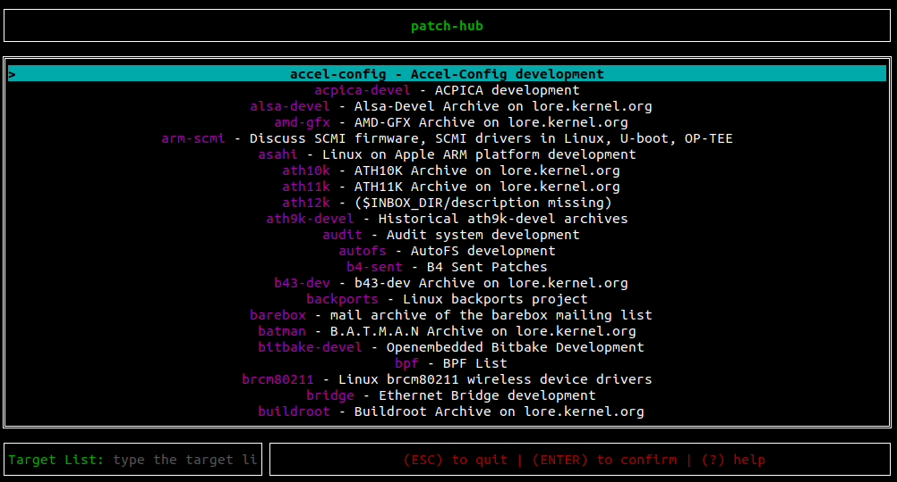
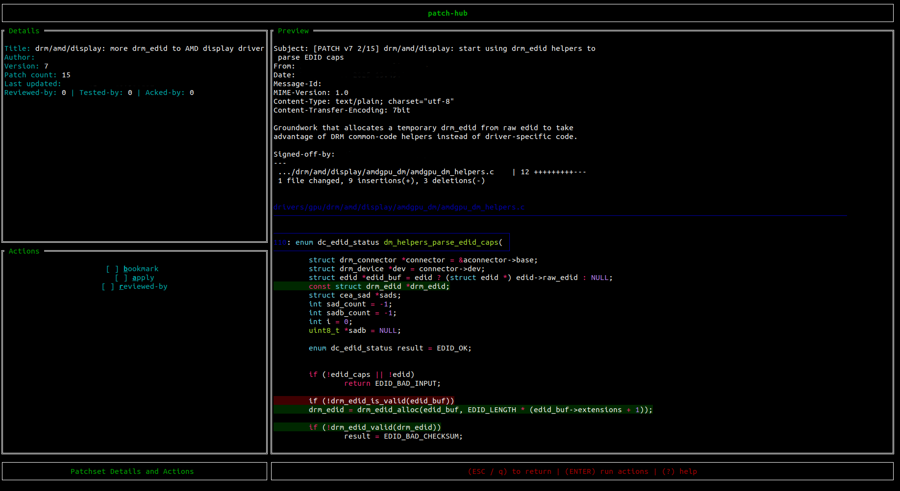
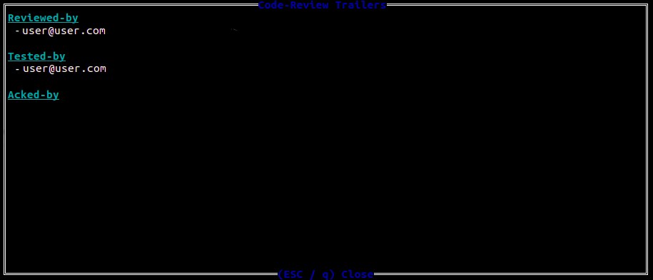
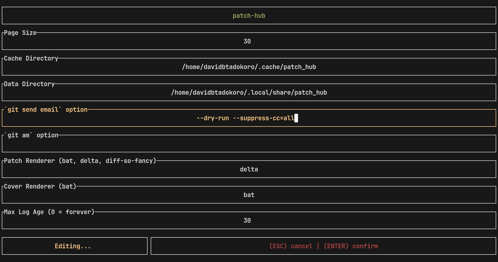

# Summary

`Patch-hub` is a terminal-based software written in Rust that aims to streamline one of the key workflows in the Linux kernel development model: reviewing patches. Its main features include browsing the patches of each Linux development mailing list, applying them locally for validation, and also the option to respond to them with a _Reviewed-by_ tag.

Beyond its practical value, `patch-hub` is part of a broader effort to modernize Linux kernel development workflows and mitigate bottlenecks. By simplifying how reviewers and developers interact with patches, the tool not only reduces friction in the review process but also creates opportunities for empirical research on software engineering practices within this ecosystem.

# Statement of need

A recent area of interest within the Linux kernel community is the long-term sustainability of its development process [@linux-sustainability-sbes-iier]. For instance, there is concern that the workload of maintainers is not scaling and presents many challenges, as indicated by many community publications [@maintainersScale;@maintainersGap;@movingOnMaintainer;@twoPerspectives;@sayingNo;@MaintainersTruth;@tooManyLords;@maintainersParadox]; in particular, there is a mismatch between the volume of submitted patches and the capacity to review and integrate them into the project [@rigby-peer-review]. This scenario highlights potential bottlenecks in the workflow of maintainers, which may impact the project's growth.

On a broader scope, the Kworkflow (`kw`) project [@kw-sbes-tools] is a hub of tools that aim to support the most varied workflows of kernel developers. In this sense, `patch-hub` is a sub-project of `kw`, with its dedicated codebase and focus on maintainers by directly addressing the bottlenecks associated with patch review. The tool enhances this workflow, which has traditionally involved fragmented, complex, and poorly standardized tasks. Furthermore, `patch-hub` can also serve as a central platform for research on the review cycle, enabling both a deeper understanding of the relationships among the actors involved and empirical evaluations of strategies to optimize this part of the development flow.

# Introduction

The development of the Linux kernel is one of the most prominent examples of a large-scale Free Software project. Dozens of subsystems and thousands of contributors have allowed Linux to continue evolving for decades, making it the foundation of most modern computing systems. The project follows a rigorous review and integration process before a contribution, also known as a _patch_, can reach the software's end users.

In general, kernel development involves many repetitive tasks, both for contributors who seek to have their code incorporated and for maintainers who must ensure the high quality of the contribution. Among these tasks, we emphasize compiling, running, and testing the Linux kernel, as well as organizing, sending, and responding to patches. In practice, this translates to executing long sequences of verbose commands, which waste considerable time to type, are incredibly error-prone, and must be repeated multiple times throughout the development and review of contributions.



Due to the repetitive nature of these tasks, it is common for kernel developers to create or adopt _ad hoc_ scripts to automate such processes, in order to speed up execution and reduce the likelihood of errors. As a result, this tooling is generally decentralized, leading to duplicated efforts and contributing to the lack of robust standardized solutions for some of these tasks.

A Free Software project that aims to mitigate this issue is `kw`. Written in Bash, the software helps Linux kernel developers perform various tasks through a unified Command-Line Interface (CLI). Among many other features, users can seamlessly compile and deploy the kernel from source, as well as manage multiple custom configurations for different environments and use cases. In this way, `kw` directly addresses the main bottlenecks arising from repetitive tasks, allowing developers to focus on reviewing and contributing patches themselves.

Within kw, another notable functionality, which has become an independent utility and is the central topic of this paper, is `patch-hub`. With its dedicated repository and implemented in Rust, `patch-hub` is a Terminal User Interface (TUI) focused on the interaction between developers/maintainers and the _patchsets_ (groups of related patches representing a single contribution) representing the development of Linux. Each command in `kw` targets one or more specific tasks, and in the case of `patch-hub`, its goal is to simplify user interaction with mailing lists and the patchsets of each subsystem. Its main features include browsing mailing lists, viewing all patchsets within a list, and interacting with individual patchsets, such as applying one to the local kernel tree or saving a patchset for later analysis.

Under the hood, `patch-hub` leverages _Lore_ (lore.kernel.org), the public archive of the Linux development mailing lists, which supports searching for messages and patchsets on demand, in contrast to the traditional model based on subscribing to the lists. Beyond its practical value, `patch-hub` enables empirical investigations into the workflows of maintainers. With appropriate data collection, it could even support studies in software engineering aimed at maintaining large-scale projects.

# patch-hub

## Features

In general, the main features of patch-hub are aligned with the goal presented in the previous section: to simplify the interaction between those involved in kernel development — contributors, reviewers, and maintainers — and the patchsets of each subsystem.

It is worth noting that the project remains in continuous development, and some upcoming features will be exposed in the **Next Steps** section. The following subsections present the most relevant features currently implemented and available to the tool’s end users.

### Integration with mailing lists

Users can browse the mailing lists of each subsystem available on lore.kernel.org. For each list, they can navigate through the submitted patchsets — from the most recent to the oldest — and analyze each patchset individually.



### Patchset rendering

For every patchset, users can first view its metadata, which includes the title, author, patchset version, and the number of reviews, tests, or acknowledgments (acks) it has received. They can also inspect each individual patch within the patchset, as well as the patchset’s cover letter. For each patch, the commit message and the code diff can be viewed. This allows users to follow the full flow of who submitted the patch and to review each change introduced by the patchset individually.



### Patchset management

Beyond simply viewing patchsets, users can actively interact with them. Three main actions are supported:

1. Bookmarking a patchset to access it later.
2. Applying the patchset to a local kernel tree, to validate and test the proposed changes.
3. Replying to a patchset with a Reviewed-by trailer, to indicate that the patchset has been reviewed.



### Custom configuration

Another important feature is the ability to customize certain system settings. The main options include: selecting which tool will be used to render patchsets, configuring how many patchsets are displayed per page, defining directories for data and cache storage, and setting log retention periods. Users can also configure integration with Git commands: git send-email for replying to patchsets, and git am for applying a patchset to the local kernel tree. This ensures that the review and application workflow can be tailored to each user’s preferences.



## Architecture

The patch-hub architecture can be divided into two fundamental parts:

1. The core of the application, which handles all state changes triggered by user interaction.
2. The integration with lore.kernel.org, which provides access to up-to-date patchsets.

### MVC (Model–View–Controller)

The core of the application was developed following the Model–View–Controller (MVC) design pattern, where Model represents the aggregation of all application states, View represents the abstraction of how those states are rendered to the user, and Controller manages user interactions and requested actions.

#### Model

Practically speaking, patch-hub defines a struct named App, which implements the Model layer. In summary, it contains:

- A `CurrentScreen` attribute, indicating the application’s active screen.
- One struct for each possible screen the user can access (`MailingListSelection`, `BookmarkedPatchsets`, `LatestPatchsets`, `DetailsActions`, `EditConfig`).
- A `Config` struct that stores the current configuration.
- A `BlockingLoreAPIClient` struct that represents the HTTP client responsible for communicating with lore.kernel.org.

```Rust
pub struct App {
    pub current_screen: CurrentScreen,
    pub mailing_list_selection: MailingListSelection,
    pub bookmarked_patchsets: BookmarkedPatchsets,
    pub latest_patchsets: Option<LatestPatchsets>,
    pub details_actions: Option<DetailsActions>,
    pub edit_config: Option<EditConfig>,
    pub config: Config,
    pub lore_api_client: BlockingLoreAPIClient,

	/// other less relevant attributes omitted
}
```
Listing 1: App struct snippet.

As expected, the Model layer does not handle either end of the application — user interaction or terminal rendering — but only the core logic of the system. The `App` struct is responsible for storing each screen’s state, the loaded patchsets, configuration data, and for orchestrating transitions between states.
However, it does not directly handle user input or screen rendering.

#### View

Since patch-hub is a TUI, the View layer focuses on rendering each screen in the terminal. Concretely, whenever a state change occurs, the terminal is redrawn with the relevant information for the user, via the `draw_ui()` function. This function retrieves the current screen from the App and renders it according to its definition and current state. To draw widgets, patch-hub uses the Rust library Ratatui, which provides definitions for color, alignment, geometric shapes, and other UI components.

Besides rendering individual screens, some UI components — such as loading screens and pop-up windows — can appear across multiple views. Their rendering behavior is also handled within the View layer.

```Rust
pub fn draw_ui(f: &mut Frame, app: &App) {
	// beggining of the function omitted

    let chunks = Layout::default()
        .direction(Direction::Vertical)
        .constraints([
            Constraint::Length(3),
            Constraint::Min(1),
            Constraint::Length(3),
        ])
        .split(f.area());

    render_title(f, chunks[0]);

    match app.current_screen {
        CurrentScreen::MailingListSelection => mail_list::render_main(f, app, chunks[1]),
        CurrentScreen::BookmarkedPatchsets => {
            bookmarked::render_main(f, &app.bookmarked_patchsets, chunks[1])
        }
        CurrentScreen::LatestPatchsets => latest::render_main(f, app, chunks[1]),
        CurrentScreen::PatchsetDetails => details_actions::render_main(f, app, chunks[1]),
        CurrentScreen::EditConfig => edit_config::render_main(f, app, chunks[1]),
    }

    navigation_bar::render(f, app, chunks[2]);

    /// rest of the function omitted
}
```
Listing 2: draw_ui() function snippet.

Notably, the View layer has no knowledge of how information is stored or which user interactions led to the current state. It only needs the current state to decide how to compose and display the interface elements.

#### Controller

The Controller layer coordinates the chain of operations triggered by user actions.
In general, it captures keyboard events and routes them to their corresponding actions, which typically involve an update to the App (Model), followed by a screen redraw (View). Each screen has its own event handler, and whenever a user action causes a screen transition, the corresponding handler function is invoked.

Thus, the Controller directly interacts with both the Model and the View, orchestrating their operation at a high level.

```Rust
match key.code {
	KeyCode::Char('?') => {
		let popup = generate_help_popup();
		app.popup = Some(popup);
	}
	KeyCode::Esc | KeyCode::Char('q') => {
		app.reset_latest_patchsets();
		app.set_current_screen(CurrentScreen::MailingListSelection);
	}
	KeyCode::Char('j') | KeyCode::Down => {
		latest_patchsets.select_below_patchset();
	}
	KeyCode::Char('k') | KeyCode::Up => {
		latest_patchsets.select_above_patchset();
	}
```
Listing 3: Example of Key-to-action routing.

### Lore API

With the MVC structure established, the other main pillar of patch-hub is its integration module with lore.kernel.org, which enables fetching patchsets. This module is not part of the MVC structure because it operates independently of the core business logic — it merely provides data to patch-hub, and could be replaced by another source without requiring changes elsewhere in the system.

The primary goal of this module is to communicate with lore.kernel.org through HTTP requests to retrieve the list and details of patchsets.

The HTTP client is represented by the `BlockingLoreAPIClient` struct, responsible for managing requests, handling network communication (headers, timeouts, etc.), and parsing the XML responses from the site.

Three main endpoints were implemented to provide all the information patch-hub needs about patches from lore.kernel.org:

- **request_available_lists**: returns all mailing lists of kernel subsystems available on lore.kernel.org;

- **request_patch_feed**: given a mailing list, returns the list of patchsets it contains;

- **request_patch_html**: given a patchset ID, returns the complete information about it and its contents.

The integration module also includes another struct, LoreSession, which acts as an intermediary between the App screens and the external data source. It is responsible for calling the `BlockingLoreAPIClient`, processing XML responses, storing loaded patchsets along with their associated mailing lists, and providing this data to the App whenever required.

This design keeps the external data source decoupled from the core application logic, facilitating both testing and potential future replacement or extension of how patchsets are retrieved.

```Rust
fn request_available_lists(&self, min_index: usize) -> Result<String, ClientError> {
	let available_lists_url = format!("{}/?&o={min_index}", self.lore_domain);

	let body: String = ureq::get(&available_lists_url)
		.header("Accept", "text/html,application/xhtml+xml,application/xml")
		.call()?
		.body_mut()
		.read_to_string()?;
	Ok(body)
}
```
Listing 4: Example of HTTP request to Lore.

## Discussion

### Rust

There are two main motivations behind choosing Rust for the development of patch-hub. First, although patch-hub does not have strict constraints such as high performance or limited memory usage, Rust offers several characteristics that provide universal benefits to software projects. Notably:

- Memory safety, enforced at compile time, which prevents a wide range of well-known programming bugs such as use-after-free, dangling pointers, and double free.

- Idiomatic expressiveness, arising from Rust’s language design, which encourages clean code practices and enhances code readability. Key features include immutability by default and constructs such as Result, Option, and functional-style iterator combinators (map, filter, find, collect, etc.).

The second motivation is more abstract, directly related to the context in which patch-hub is situated and reflects recent trends in the Linux kernel development community. The adoption of Rust in patch-hub aligns with one of the project’s implicit goals: the modernization of the Linux kernel development process. In recent years, there has been a significant movement within the kernel community, even endorsed by Linus Torvalds, toward introducing Rust into this ecosystem. Although the kernel has historically been written in C, which provides high performance and a great deal of developer freedom, the motivation for incorporating Rust primarily lies in its compile-time memory safety guarantees, as mentioned above.

Thus, patch-hub follows this growing enthusiasm for the language and aligns itself with the community’s ongoing trends. Moreover, contributing to patch-hub — or to any other open-source projects written in Rust — can be seen as an opportunity to prepare for future contributions to the kernel itself, especially considering that one of the key challenges in adopting Rust is its relatively steep learning curve.

### Importance

A recurring concern among Linux kernel developers in recent years has been the sustainability of the development cycle, especially considering the bottlenecks created by the project’s scale combined with outdated development processes. One possible way to address these challenges — as discussed in [CITATION] — is through the increasing use of development support tools, which can help reduce the cognitive and operational burden of tasks that are secondary to the system’s evolution itself.

In the context of interacting with patches, users must understand the dynamics of mailing lists and learn the steps and conventions involved in patch submission and review. These factors can slow down the development cycle and make it harder to integrate new contributors, reviewers, and maintainers.

Patch-hub is one such support tool that aims to directly improve this scenario. By allowing users to visualize, validate, and respond to patchsets more quickly, intuitively, and in a centralized manner, the tool eliminates or simplifies many of the steps traditionally required in the process.

The lore.kernel.org platform itself is an example of a tool designed to simplify how users interact with patchsets. patch-hub builds on this well-established system, extending its functionality and usability so that users need nothing beyond their terminal to work with patchsets.

For these reasons, patch-hub can be viewed as a bridge between the traditional practices of kernel development — which depend on tools and technologies that are increasingly uncommon in modern software engineering — and more contemporary approaches that emphasize user experience as a means to boost productivity and reduce the likelihood of errors. Furthermore, when considered within the broader context of its integration with kw, patch-hub can significantly expand the potential for automation and, consequently, accelerate the entire development workflow.

Another point worth highlighting is the tool's potential to serve as a platform for experimentation and metrics collection regarding the kernel contribution process. The analysis of data and feedbacks generated during its use could enable investigations into different aspects of the patch review cycle — such as review time, volume and engagement in reviews, among other metrics related to reviewers' interactions with patches.

In this way, patch-hub not only facilitates the daily work of contributors, but also creates opportunities for comparative studies between its use and the traditional patch review flow, fostering broader discussions about collaboration and efficiency in large-scale projects, and specifically how these factors can affect the future of kernel Linux development.

### Next steps

There are two clear next steps for patch-hub. The first is to improve the tool’s integration with its predecessor, kw, so that it becomes possible, for example, to compile and deploy a patch or patchset under review in a more automated way, directly from patch-hub itself. Furthermore, given the strong relationship between the tools, additional initiatives can be undertaken to enhance this integration, making the overall development flow even more centralized and seamless.

The second step involves instrumenting patch-hub to enable, with user consent, the collection of telemetry data during its execution. By anonymizing and sending this information to a server, it would be possible to consolidate user data and analyze it to identify bottlenecks, understand usage patterns, and propose improvements that reduce friction in the revision flow. The existence of this metrics collection infrastructure will facilitate the design and comparison of future experiments involving Linux kernel developers. The existence of this metrics collection infrastructure will also facilitate the design and comparison of future experiments involving Linux kernel developers. Finally, it can support broader reflections on tool usage and user behavior, as discussed in the previous section.

# Acknowledgements

# References
